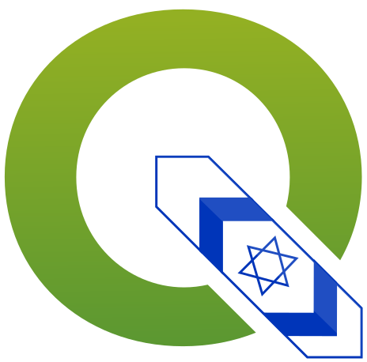

<link rel="stylesheet" href="rtl.css">

# QGIS Israeli User Group Website
# אתר קבוצת המשתמשים הישראלית של QGIS

ברוכים הבאים לאתר קבוצת המשתמשים הישראלית של QGIS!  
קבוצת המשתמשים הישראלית של QGIS היא קהילה פתוחה לכל המשתמשים, מפתחים ומתעניינים בתוכנת QGIS בישראל.  
הקבוצה פועלת לקידום השימוש בתוכנת QGIS, שיתוף ידע, משאבים, מדריכים וחדשות הקשורות ל-QGIS בישראל.

## מטרות קבוצת המשתמשים

קבוצת המשתמשים הישראלית של QGIS  שואפת להיות קהילה תומכת ומקדמת את השימוש בתוכנת קוד פתוח למערכות מידע גאוגרפיות (GIS) בישראל.  
 מטרות הקבוצה כוללות:
* הפצת מידע על QGIS
* קידום שימוש בתוכנה בישראל
* ריכוז מדריכים וסרטוני הדרכה בעברית
* ארגון מפגשי משתמשים וימים פתוחים
* תיאום פיתוח, עם דגש על סטנדרטים וצרכים מקומיים ולאומיים
* איסוף דוגמאות שימוש מקומיות
* בחירת נציג שיפעל כחבר מצביע בפרויקט QGIS העולמי*
* הקמת קבוצות עניין מקצועיות

*תלוי בהכרה רשמית של הקבוצה על ידי פרויקט QGIS

## הצטרפות לקבוצת המשתמשים

ניתן להצטרף לקבוצת המשתמשים הישראלית של QGIS באמצעות הטופס הבא:  
[טופס הצטרפות לקבוצת המשתמשים](https://forms.gle/toMKEDqw5Knqehyw8)

ההצטרפות אינה כרוכה בעלות וזמינה לכל המעוניין.  
הצטרפות לקבוצת המשתמשים מאפשרת קבלת עדכונים על אירועים, מפגשים, מדריכים ומשאבים נוספים הקשורים ל-QGIS בישראל.  
כמו כן, חברים בקבוצת המשתמשים יוכלו להתמודד ולהצביע לנציג הקבוצה בפרויקט QGIS העולמי, כאשר הקבוצה תזכה להכרה רשמית ולוועד המנהל של הקבוצה (תפקיד התנדבותי).  

מצופה מחברי קבוצת המשתמשים להתנהל בשיח מכבד, בין אם במייל, במפגשים (פיזיים ווירטואליים), או בקבוצות הוואטסאפ והפייסבוק.

## הועד המנהל של קבוצת המשתמשים

הועד המנהל של קבוצת המשתמשים מורכב ממתנדבים פעילים בקהילה, אשר תפקידם לקדם את מטרות הקבוצה ולארגן פעילויות ואירועים.  
מתנדבים נוספים מוזמנים להצטרף לועד המנהל על מנת לתרום לקידום הקבוצה.  
ניתן לפנות לועד המנהל באמצעות המייל:

[qgis.israel@gmail.com](mailto:qgis.israel@gmail.com)

## משאבים וקישורים נוספים

[ימים פתוחים](https://qgis-il.github.io/QOD/)  

[קישור לאתר הרשמי של QGIS](https://qgis.org/)

[קישור לקבוצת הפייסבוק של QGIS ישראל](https://www.facebook.com/groups/qgisinisrael)

[קישור לקבוצת הוואטסאפ של QGIS ישראל](https://chat.whatsapp.com/LcMSbVONvAU0sddIpHCPo4)

[קישור לערוץ היוטיוב של QGIS ישראל](https://www.youtube.com/@QGIS-IL)

[קישור לגיטהאב של QGIS ישראל](https://github.com/qgis-il)
